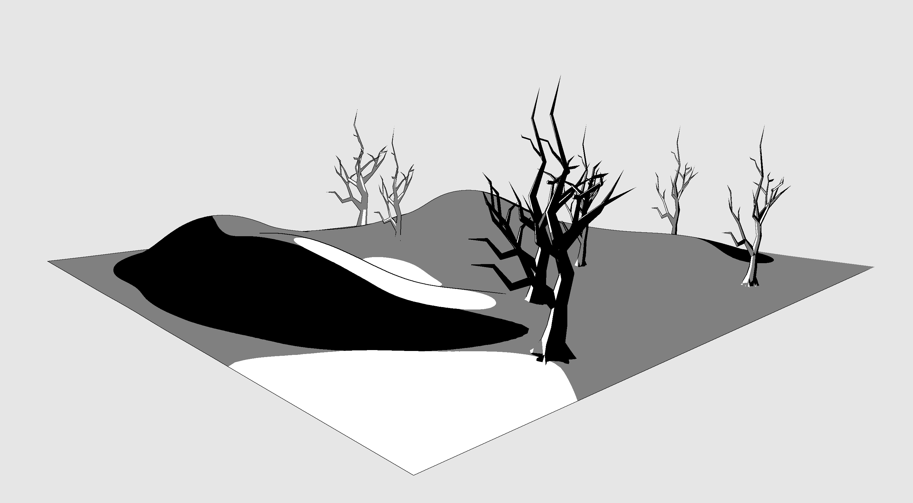
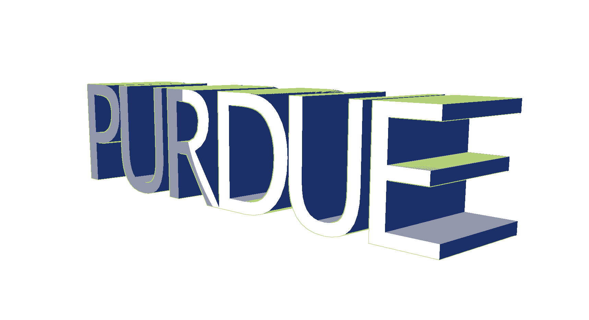
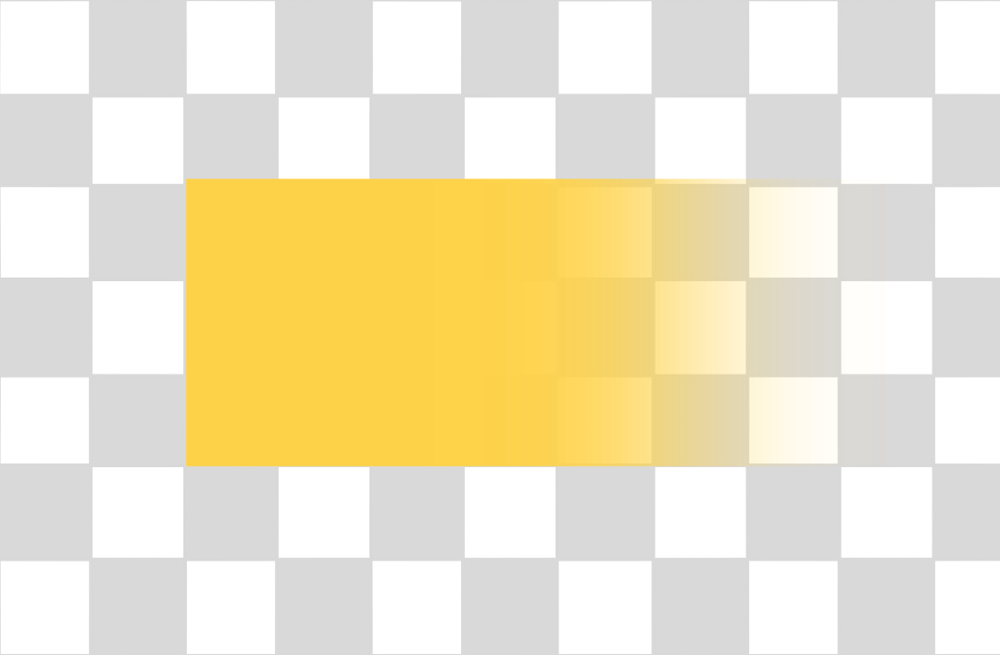
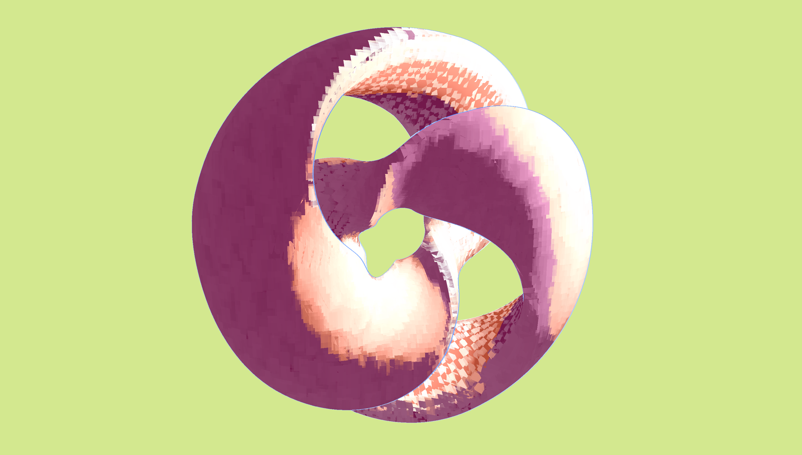
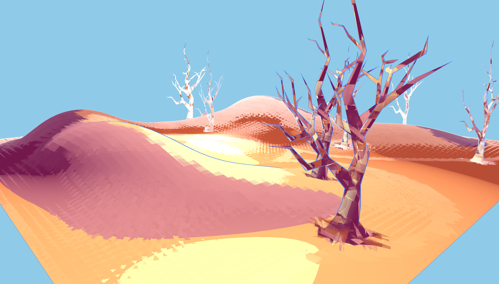
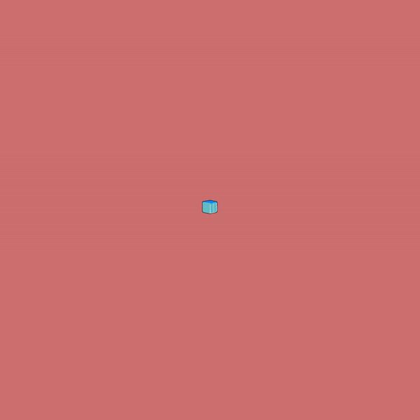

# NPR-SPH
A project to showcase non-photorealistic rendering and smoothed-particle hydrodynamics.

Full project demo: https://github.com/VarunRamakri7/NPR-SPH/blob/main/demo.mp4

## NPR
Functions:

    - User can select outline color, background color, dark tone, mid tone and highlights.
    
    - For SPH Particles, user can change particle sizes. 

Implementation:

    - Edge detection with Sobel Operator on the fragment depth value to get inner and outer contours. 
    
    - Brush strokes geometry added with geometry shader. 

1. _Cel Shader_

Implemented Cel/Toon shading which is based on cook-torrance lighting where user can also adjust specular values. 

2. _Stylistic Shader_

Implemented based on phong shading where user can also adjust specular values. 

- Each brush stroke is a rectangular stroke with fading opacity and variations in opacity and color at each corners. 

Strokes and outlines that are further away from the eye will be more desaturated. Similarly, outlines closer to the eye will be thicker than those further away.

## SPH

Current SPH simulation (with 8000 particles) looks like:

Interactivity:
- Press 'p' to pause/unpause the simulation.
- Press 'r' to reset particle positions.

Future Work:
- Increase number of particles.
- Optimize neighbourhood search.
- Add objects for particles to collide with.
